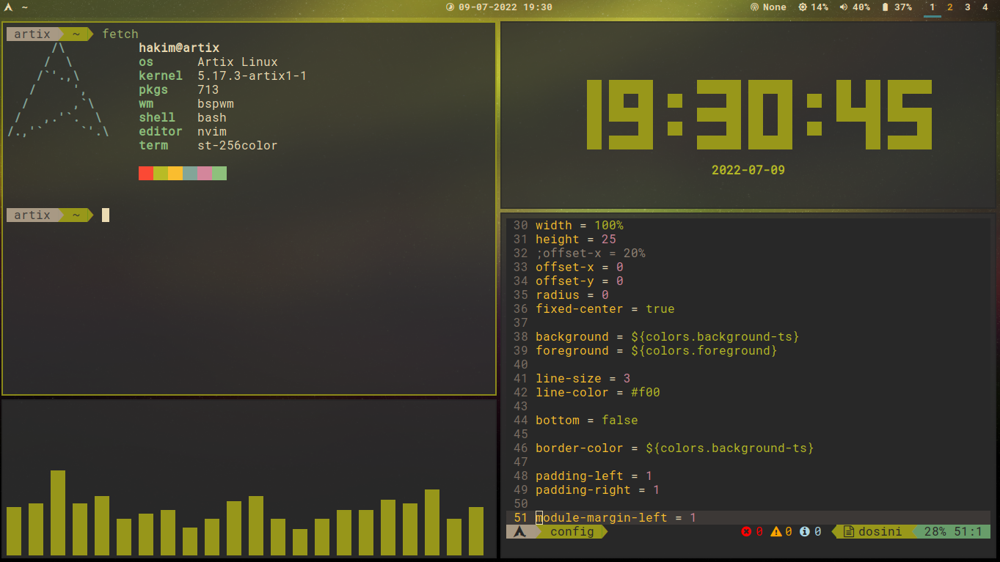

# Public Dotfiles
My minimalistic dotfiles for you to review, use and modify.

## Components
- Bspwm [(link)](https://github.com/baskerville/bspwm) + Sxhkd [(link)](https://github.com/baskerville/sxhkd)
- Polybar [(link)](https://github.com/polybar/polybar)
- Fish (Friendly Interactive Shell) [(link)](https://fishshell.com/)
- Neovim (v0.5 or latest) [(link)](https://neovim.io/)
- Nerd Font [(link)](https://www.nerdfonts.com/)

## Installation
Just copy and paste those folders (except for `images`) to `~/.config/` :D

## My Learning Sources
- [Takuya's dotfiles](https://github.com/craftzdog/dotfiles-public)
- [almighty dotfiles](https://github.com/addy-dclxvi/almighty-dotfiles)

